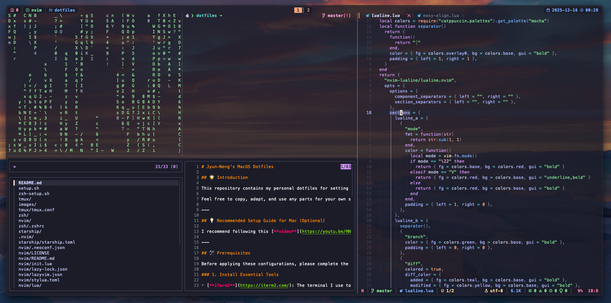

# Jyun-Neng's MacOS Dotfiles

 

## 🌟 Introduction

This repository contains my personal dotfiles for setting up and configuring a new macOS environment.

Feel free to copy, adapt, and use any parts for your own setup!

---

## 💡 Recommended Setup Guide for Mac (Optional)

I recommend following this [**video**](https://youtu.be/RNqDkF17ogY) guide for the general setup of your Mac (you can skip the part where he installs his personal dotfiles):

---

## 🛠️ Prerequisites

Before applying these configurations, please complete the steps in this section.

### 1. Install Essential Tools

* [**iTerm2**](https://iterm2.com/): The terminal I use to run all the configurations.
* [**Homebrew**](https://brew.sh/): A package manager for macOS.
* [**GNU Stow**](https://www.gnu.org/software/stow/): Used for managing and symlinking the dotfiles into their respective directories.
    ```shell
    brew install stow
    ```
* [**Starship**](https://starship.rs/): A minimal, blazing-fast, and infinitely customizable prompt for any shell.
    ```shell
    brew install starship 
    ```
* [**Zoxide**](https://github.com/ajeetdsouza/zoxide): A smarter `cd` command.
    ```shell
    brew install zoxide 
    ```
* [**Nerd Fonts Repository**](https://github.com/ryanoasis/nerd-fonts): Provides beautiful, enhanced fonts for terminal use.

### 2. Install Oh My Zsh and Zsh plugins

**Run the Zsh setup script**: This script installs [Oh My Zsh](https://ohmyz.sh), [fzf](https://github.com/junegunn/fzf), and all required Zsh plugins.

```shell
bash zsh-setup.sh
```

> **Note:** To learn how to use `fzf`, please refer to the linked repository.

### 3. Neovim Setup (Work In Progress)

---

## 🚀 Configuration Guides

Once all prerequisites are met, follow these sequential steps to deploy and configure the dotfiles.

### 1. Create Configuration Symlinks

Use the main setup script to create symlinks for configuration files (`zsh`, `starship`, and `tmux`) to their corresponding directories using `stow`.

```shell
bash setup.sh
```

### 2. Configure Zsh

After creating the symlinks, you must apply Fast-Syntax-Highlighting theme:
  * **Restart** your terminal session for the changes to take effect.
  * Switch the fast-syntax-highlighting theme to `Catppuccin-Mocha`.
  ```shell
  fast-theme XDG:catppuccin/themes/catppuccin-mocha
  ```

### 3. Configure Tmux

Tmux plugins must be manually fetched after the symlinks are created:
  * Run `tmux` and press `prefix` (`Ctrl+q`) + `I` (capital i) to fetch and install the plugins

---

## 🤝 Contribution

If you have any suggestions or find any issues, feel free to open an issue or submit a pull request!
