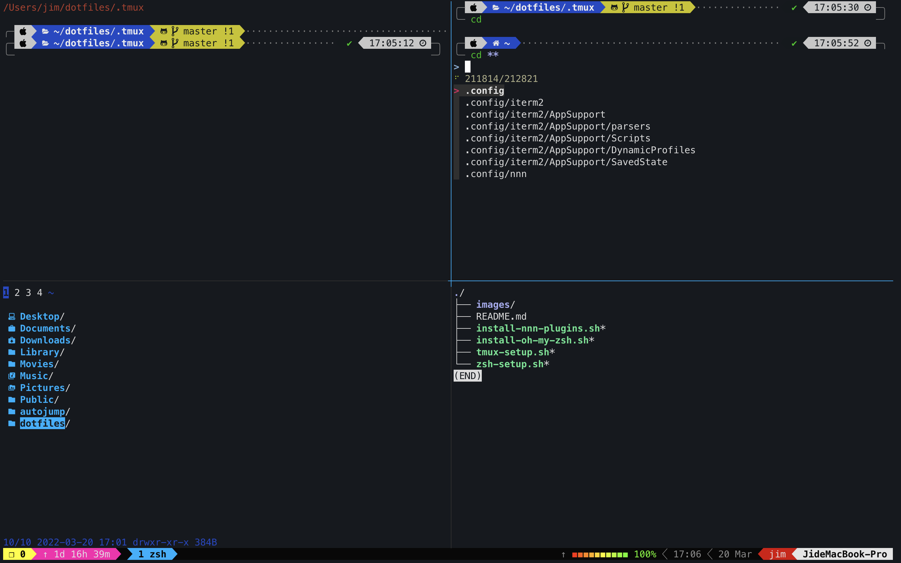

# Jyun-Neng's dotfiles for macOS



## Introduction

This repository serves as my way to setup my Mac. Feel free to copy parts for your own dotfiles.

## Setting up your Mac

### Before you apply this repo to set up your Mac

I recommand you follow this [video](https://youtu.be/RNqDkF17ogY) to set up your Mac first. But you do not have to install his dotfiles.

Another tool you need is [GNU Stow](https://www.gnu.org/software/stow/). I use this to manage my dotfiles.

```shell
brew install stow
```

After you did all above, you may now follow instructions below to setup

1. shell (ZSH), 
2. tmux, and
3. neovim (TODO)

### Setting up ZSH

1. Install [Oh My Zsh](https://ohmyz.sh)
```shell
./install-oh-my-zsh.sh
```
2. Install all plugins and tools required in zsh configurations
```shell
./zsh-setup.sh
```
**NOTE**: `zsh-setup.sh` will install [fzf](https://github.com/junegunn/fzf). To know how to use fzf, you can enter the link.

3. Create symlink of all zsh configurations to your `$HOME` directory
```shell
stow .zsh
```

This zsh setting uses [Powerlevel10k](https://github.com/romkatv/powerlevel10k). If the icons are not showing, please check if you are using [Nerd Fonts](https://github.com/ryanoasis/nerd-fonts). Please see [Fonts](https://github.com/romkatv/powerlevel10k?tab=readme-ov-file#fonts) for the detail.

### Setting up Tmux
For Tmux configuration, I recommand using [Gregory's Tmux configurations](https://github.com/gpakosz/.tmux).

1. Install Gregory's Tmux configuration
```shell
./tmux-setup.sh
```
2. Create symlink of my tmux configuration to your `$HOME` directory
```shell
stow .tmux
```

### Setting up NEOVIM

1. Read [README](https://github.com/Jyun-Neng/dotfiles/tree/master/.neovim/README.md) in `.neovim`
2. Create symlink of my vim configuration to your `$HOME` directory
```shell
stow .neovim
```

